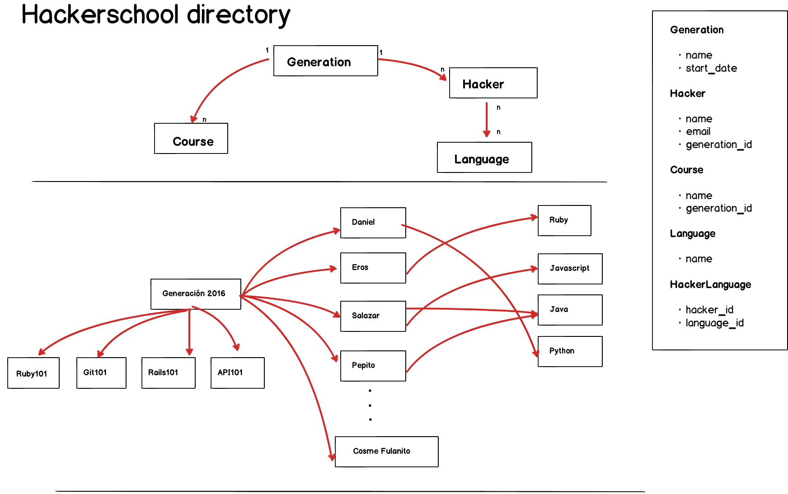

## Hackershool directory guide

1. Fork hackerschool_directory repository we just made
2. Run `bundle install` to install any dependency
3. Run `rake db:migrate` to create the schema
4. Complete user stories described in [here](#user-stories)
5. Ensure your application meets the [requirements](#requirements)
5. Make a PR to hackerschool repository once you have finished.

## Model attributes 

## User stories

* As a user I have access to all CRUD *(Create, Read, Update, Delete)* operations for generations
* As a user I have access to all CRUD *(Create, Read, Update, Delete)* operations for hackers
* As a user I have access to all CRUD *(Create, Read, Update, Delete)* operations for courses
* As a user I have access to all CRUD *(Create, Read, Update, Delete)* operatios for languages 
* **Bonus point:** As a user I want a general perspective of hacker school generations (*check [report requirement](#reports) section*)

## Requirements

- Generations must be accesed through `/generations`
- Hackers must be accessed through `/hackers` 
- Languages must be accesed through `/languages`
- A hacker email must be unique
- A hacker name must be mandatory
- All generation attributes must be mandatory. E.g a generation must have a name and a start_date
- A course name must be mandatory 

### Reports (bonus points) 

- Create a new controller called `reports` 
- This controller will only have one action: `general`. This action will contain two sections: Hacker section & Course section
- Hacker section:
	- Will display the total number of hackers in the generation 
	- Will display every hacker in the generation along with their data (just the name and the ID)
		- Hacker id must be link to hacker detail (show action in hacker controller) 
		
- Course section:
	- Will display the total number of courses in the generation 
	- Will display every course given in the generation along with their data
		- The Id must be a link to the detail of the course (show action in the course controller)

