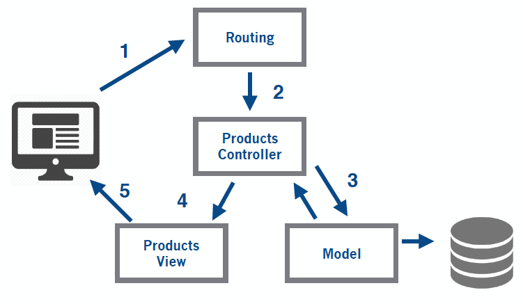

# Gettting started with Rails

## Table of contents

* [Structure of Rails app](#structure-of-rails-app)
* [Rails Conventions](#rails-conventions)
* [Controllers](#controllers)
	* [Conventions](#conventions)
	* [Generator syntax](#generator-syntax)
	* [Actions & rendering](#actions--rendering)
* [Models](#models)
	* [Conventions](#conventions-1)
	* [Generator syntax](#generator-syntax-1)
	* [Creating a new record](#creating-new-records)
	* [Finding existing records](#finding-existing-records)
	* [Updating records](#updating-records)
	* [Deleting records](#deleting-records)
	* [Validations](#validations)
	* [Associations](#associations)
* [Views](#views)
	* [Generating forms](#generating-forms)
	* [Helper and formatting links](#helpers-for-formatting-and-linking)
* [Basic routing](#basic-routing) 
	* [REST](#rest)
	* [Rails resources](#rails-resources)
* [Exercises](https://github.com/hackerschoolmty/Rails101/blob/master/02/exercises.md)

 
## Structure of rails app

As we saw before Rails assumes a certain runtime directory layout and provides application and scaffolds generators, which creates this layout for you. For example if we generate `my_app` using the command `rails new my_app`, the top-level directory will be something like:

```bash
$ cd my_app
$ tree -l
.
├── Gemfile
├── Gemfile.lock
├── README.rdoc
├── Rakefile
├── config.ru
├── app
│   ├── assets
│   │   ├── images
│   │   ├── javascripts
│   │   └── stylesheets
│   ├── controllers
│   │   └── concerns
│   ├── helpers
│   ├── mailers
│   ├── models
│   │   └── concerns
│   └── views
│       └── layouts
├── bin
├── config
│   ├── environments
│   ├── initializers
│   └── locales
├── db
├── lib
│   ├── assets
│   └── tasks
├── log
├── public
├── test
│   ├── controllers
│   ├── fixtures
│   ├── helpers
│   ├── integration
│   ├── mailers
│   └── models
├── tmp
│   └── cache
│       └── assets
└── vendor
    └── assets
        ├── javascripts
        └── stylesheets

38 directories
```

Rails has a place for everything, let's start with the files in the top of the application directory

| File     | Description |
|------------------|-------------|
| config.ru | Configures the Rack Webserver inteerface, either to create Rails application or to use Rack middleware |
| Gemfile | Specifies the dependencies (gems) inside our Rails application.   | 
| Gemfile.lock | Records the specific versions for each of your rails applications dependencies. This file is maintained by Bundler  | 
| Rakefile | Contains tasks to run tests, create documentation, and more. |
| README | By default this will contain general information about the Rails framework, but is recommended to use this file to create a nice introductory page so that future developers will know what our application does|


### App folder

Most of our work will happen inside the `app` directory, as the main code for the application lives below this folder. 

```bash
$ tree app/
app
├── assets
│   ├── images
│   ├── javascripts
│   │   └── application.js
│   └── stylesheets
│       └── application.css
├── controllers
│   ├── application_controller.rb
│   └── concerns
├── helpers
│   └── application_helper.rb
├── mailers
├── models
│   └── concerns
└── views
    └── layouts
        └── application.html.erb
```

### test folder

Rails owes its stability to the use of tests, and because of that it provides a layout for testing your application inside the `test` directory. 

When writing models or controllers it will produce skeleton test code automatically, so if we explore the `test` directory we'll see an output that looks really similar to the `app` directory:

```bash
$ tree test
test
├── controllers
├── fixtures
├── helpers
├── integration
├── mailers
├── models
└── test_helper.rb
```

If we're using `rspec` this folder is no longer going to be used, instead tests (or specs) will live inside `spec` folder


### configuration folder

Look at a sneak peek of this folder: 

```bash
config/
├── application.rb
├── boot.rb
├── database.yml
├── environment.rb
├── environments
│   ├── development.rb
│   ├── production.rb
│   └── test.rb
├── initializers
│   ├── assets.rb
│   ├── backtrace_silencers.rb
│   ├── cookies_serializer.rb
│   ├── filter_parameter_logging.rb
│   ├── inflections.rb
│   ├── mime_types.rb
│   ├── session_store.rb
│   └── wrap_parameters.rb
├── locales
│   └── en.yml
├── routes.rb
└── secrets.yml
```
As you can see this directory contains all our rails application needs. When we want to configure routes, database, create initializers, modified some locales or defined deployment instructions this is the folder that we are looking for. 

Some important things to notice about this folder

- Before running your application, Rails loads and executes `config/environment.rb` and `config/application.rb` files
- In addition Rails will also load a per-environment configuration file. This file lives in the `environments` directory and is where you place configuration options that vary depending on the environment
- If you have special requirements, maybe you're in favor of creating an staging enviroment, you can easily create it with rails. Just add a new configuration file (`config/staging.rb`) and a new section in the database configuration file, and you are ready to go! 

### lib folder

You can place here your files that extend the rails app functionality. Anything that isn't directly related to a model, view, or controller should be placed in `lib`. It is a good practice to create subdirectories inside `lib`, so you can group related functionality. 

You'll also find a `tasks` directory under `lib`. This is where you can write your own Rake tasks

### logs folder

As our application executes, it produces a bunch of useful logging information. This is stored by default in this directory. Here you'll find three main log files:

```bash
$ tree log/
log/
├── development.log
├── production.log
└── test.log
```
This log contains trace lines, timing statistics, cache information, database queries executed and so on

### public folder

This is the folder that the outside world can see, the external face of your application. Contains static files and compiled assets

### bin folder

Contains all necessary scripts to run your application,  and that means that this directory contains the Rails script. This is the script that is run when you execute `rails` command in the command line. Take notice that the first argument you pass to that script determines the function Rails will perform. 

### tmp folder

Just like the name says, this one will include temporal files (caches, pids and sessions files). Generally this files are cleaned up automatically by Rails, but ocassionally if things go wrong, you might need to look in here and delete old files

### vendor folder

This is a place for all third-party code. In a typical rails application this includes vendored gems 

### documentation folder

This directory is no longer part of the required directories, and it won't be created in your Rails app by default. But just for you know Rails provides a bundle of rake tasks to generate automatic documentation, and all the files generated will be placed inside the `doc` folder.

* `doc:app` will generate application documentation in HTML format
* `doc:rails` will provide documentation for the version of Rails you're runnning. Just note that this command will take a while. 
* `doc:guides` will provide oficial rails guides. This needs `redcarpet` gem, so make sure to to add it to Gemfile before you run this command.

## Rails conventions

* **Variable names**. We follow the ruby conventions: all letters are lowercase and words are separeted by underscores. E.g: `order_status`

* **File names**. Applies same rules for variable names, files are named using lowercase and underscores. E.g `line_item.rb`

* **Classes & modules**. Each word in the phrase is capitalized (including the first). E.g `Product`

* **Tables**. Have a plural name, e.g `products`. But you really don't have to worry about this, rails does it automatically


## Controllers

Controllers are the **C** in MVC, and are just ruby classes that inherits from `ApplicationController` and has methods just like any other class. 

After the server received a response, and the router determined which controller to use for a request, the controller is responsible for making sense of the request and produce the appropriate output. 

### Conventions

* Controllers lives under app/controllers/
* Rails favors pluralization for controller's name. For example a controller for products will be defined as  `ProductsController`, a controller for orders will be defined as `OrdersController` and so on. 
* The controller file will have `_controller.rb` at the end, so products controller will be `products_controller.rb`, orders controller will be `orders_controller.rb` and so on

### Generator syntax

To create a new controller you will need to run the "controller" generator, so if you need a controller for products:

```bash
$ rails g controller Products
      create  app/controllers/products_controller.rb
      invoke  erb
      create    app/views/products
      invoke  test_unit
      create    test/controllers/products_controller_test.rb
      invoke  helper
      create    app/helpers/products_helper.rb
      invoke    test_unit
      invoke  assets
      invoke    coffee
      create      app/assets/javascripts/products.coffee
      invoke    scss
      create      app/assets/stylesheets/products.scss
```

Take notice that in order for the generator command to work the name of the controller must be provided. You can also pass  several arguments to it, that rails will translate as actions. So this:

```bash
rails g controller Products index
      create  app/controllers/products_controller.rb
       route  get 'products/index'
      invoke  erb
      create    app/views/products
      create    app/views/products/index.html.erb
      invoke  test_unit
      create    test/controllers/products_controller_test.rb
      invoke  helper
      create    app/helpers/products_helper.rb
      invoke    test_unit
      invoke  assets
      invoke    coffee
      create      app/assets/javascripts/products.coffee
      invoke    scss
      create      app/assets/stylesheets/products.scss
```

Will create a products controller and it will defined an index action with everything you need (route, view and a method inside the controller!) Pretty cool huh?
 

### Actions && rendering 



Now that you know how the controller and action decide what to render to the user, we can learn a bit more about how that works. Normally the rendering takes place at the end of the action, generating  HTML, JS, XML, etc., back to the user. 


```ruby
class ProductsController < ApplicationController
  def index
    ...
  end
end 
``` 

The former will render by default `index.html.erb` inside `app/views/products/` directory.

But as everything in rails, you can behave differently, this will render view related to `show` action from the same controller. 

```ruby
class ProductsController < ApplicationController
  def index
    render action: 'show'
  end
end 
```

This will render `books/index.html.erb` file instead of `products/index.html.erb` file.  

```ruby
class ProductsController < ApplicationController
  def index
    render "books/index"
  end
end 
``` 


This one allows you to retrieve files from anywhere on your filesystem. 

```ruby
class ProductsController < ApplicationController
  def index
    render file: "/path/to/rails/app/views/books/edit.html.erb"
  end
end 
```

Just note that just because you can, **doesn't mean you should**. Just use the simplest one that makes sense for the code you are writing


## Models

Models handles the representation of business logic and the stored information in the database.

Models uses ActiveRecord underneath. ActiveRecord is the object-relational mapping (ORM) supplied with Rails, and it's basically the **M** in MVC

An ORM (Object Relational Mapping system) a technique that connects the rich objects of an application to tables in a relational database.

### Conventions

- **Database Table.** Plural with underscores separating words (e.g., `book_clubs`).
- **Model Class.** Follows the same conventions of ruby classes: Singular with the first letter of each word capitalized (e.g., `BookClub`).


| Model / Class	| Table / Schema |
|--------------|-----------------|
| User		| users |
| Article	| articles |
| LineItem	| line_items |
| Mouse		| mice |
| Person	| people |
| TaxAgency | tax_agencies |

- **Foreign keys.** These fields should be named following "Singularized Table Name" pattern *singularized_table_name_id* (e.g., `item_id`, `order_id`). These are the fields that Active Record will look for when you create associations between your models.

- **Primary keys.** By default, Active Record will use an integer column named id as the table's primary key. When using Active Record Migrations to create your tables, this column will be automatically created.

- **`created_at` & `updated_at`** Automatically added by model generator. ActiveRecord  uses `created_at` to set the current date and time when the record is created and `updated_at` to set the current time and date whenever the record is updated

- **ID.** By default migration added by model generator will include the id[autoincrement] column as an index.

#### Overriding conventions

Although Rails handles most of your database configuration, occasionally you might want to change that:


```ruby
class Product < ActiveRecord::Base
  self.table_name = "regular_products"
  self.primary_key = "product_id"
end
```

### Generator syntax

Rails model generator follow this guidelines


```bash
$ rails g <model_name> [attributes optional]
```

Normally we would create models in two different ways:

* By just creating the model with no attributes. 

```bash
$ rails g model Pet
invoke  active_record
      create    db/migrate/20160201220912_create_pets.rb
      create    app/models/pet.rb
      invoke    test_unit
      create      test/models/pet_test.rb
      create      test/fixtures/pets.yml
```

Later we'll have to add pet attributes in another migration

* By including attributes in the generator:

```bash
$ rails g model Pet name:string
      invoke  active_record
      create    db/migrate/20160201220954_create_pets.rb
      create    app/models/pet.rb
      invoke    test_unit
      create      test/models/pet_test.rb
      create      test/fixtures/pets.yml
```

The only difference is that migration will include `name` as a column for `pets`table


### Creating new records

Given that Rails represents tables as classes and rows as objects, it follows that we create rows in a table by creating new objects of the appropiate class

#### `new` method

Let's say that we want to create a new `Product`, and this model just has an attribute of `name`, we'll do something like this

```ruby
product = Product.new
product.name = "A productirijillo"
product.save
```

The same could also be done with an optional block

```ruby
Product.new do |p|
  p.name = "A productirijillo"
  p.save
end
```
Finally we can assign a new object into a variable as a hash of attribute values:

```ruby
my_product = Product.new(name: "A Productirijillo")
my_product.save
```

If you look closely you can observe that we always use `save`method, that is because `new` method builds an object in memory, but it saves into database until `save` method is executed. 

**Note that in all of these examples we did not set the `id` attribute, ActiveRecord handles this for us!**

#### `create` method

ActiveRecord has a convenience `create` method that does the `new` and `save` method jobs at once: it instantiates the model object and stores it into database

```ruby
my_product = Product.create(name: "A Productirijillo")
```

You can also pass an array of attribute hashes, this will create  multiple rows in the database:

```ruby
my_products = Product.create(
	[ 
		{name: "A productirijillo"}, 
		{name: "another productirijillo"}
    ]
)
```

### Finding existing records

*We'll present the most common methods to read information, but you might want to check the complete [documentation](http://edgeguides.rubyonrails.org/active_record_querying.html) to see the power of ActiveRecord*

Reading from a database involves specyfing which particular rows of data are you interested in. The simplest way to finding a row in a table is by specifying it's primary key

ActiveRecord has his own query interface,
Imagine you want to find the product with an id of 3

```ruby
Product.find(3)
=> #<Product id: 3, ...> 
```

`find` method can also accept multiple primary keys values, so to find product with an id of 1 & 2:

```ruby
=> Product.find([1,2])
=> [#<Product id: 1, ...">, #<Product id: 2,...>]
```

If none of the products match the criteria an `ActiveRecord::RecordNotFound` exception will be thrown:

```ruby
=> Product.find(10008000)
ActiveRecord::RecordNotFound: Couldn't find Product with 'id'=10008000
```

If you simply want to return the whole collection you can use

```ruby
=> Product.all
=> => #<ActiveRecord::Relation [#<Product id: 1, name: "a productirijillo", ... >, #<Product id: 2, name: "another productirijillo", ...>]>
```

You can also use any other attribute in `find` method 

```ruby
=> Product.find(name: "a productirijillo")
=> #<Product id: 1, name: "a productirijillo", ...>
```

Note that `find` will always return the first record that matches the search

#### SQL 

Often you need to read rows based on criteria other thatn their primary key value. Active Record has multiple methods that correspond to SQL clauses. 

Let's check `where` clause

```ruby
= products = Product.where("status = 'ACTIVE'")
```

You can also write the former as:

```ruby
=> products = Product.where("status = ?", "ACTIVE")
```

We can use `like` clauses:

```ruby
= Product.where("name like ?", "%omputer%")
```

**Regardless of what do you put inside your `where` clause ActiveRecord will always return an `ActiveRecord::Relation` containing all the matching rows, each wrapped in an object.**

We can also use `order`, `limit`, `select` and more: 

```ruby
=> Product.where("status = 'ACTIVE'").order("price")
=> Product.where("status = 'ACTIVE'").limit(10)
=> Product.where("status = 'ACTIVE'").select("name")
```

We can go crazy and chain them together

```ruby
=> Product.where("status = 'ACTIVE'").order("price").limit(10).select("name")
```

### Updating records

Once we have found our desired records, we can update his information by calling `save` method. So to update a bunch of products:

```ruby
products = Product.where("status = 'ACTIVE'")
products.each do |product|
  product.name = "a new name"
  product.save
end
```

And that's it, that's what you're mostly gonna use. There's another methods that are kind of hidden in the documentation `update` & `update_all`. The `update` method takes an id parameter and a set of attributes, then it fetches the corresponding row, updates the given attributes, and saves the result to the database. A lot of working for just a single command don't you think? 


```ruby
Product.update(1, name: "new name")
```

`update_all` method just like the name will update all related records. We can also do something like this:


```ruby
Product.update_all(name: "new name")
```


This will only update products that were previously retrieved in the first query.


```ruby
products = Product.where("active = 'ACTIVE'")
products.update_all(name: "new name")
```


### Deleting records 

ActiveRecord supports several styles of row deletion. 

#### Delete methods

First we got the delete methods `delete` & `delete_all`, the difference is rather subtle between them:


```ruby
Product.delete(1)
```

As you can imagine it will delete the Product with an id of 1


```ruby
Product.delete_all(["price > ?", 100])
```

`delete_all` uses a condition, in the former we'll delete all products that has a price greather than 100. 

#### Destroy methods

In this case we got `destroy`, which take an ID or an array of IDs, & `destroy_all` method which takes a condition.

```ruby
Product.destroy(1)
Product.destroy_all(["created_at < ?", 30.days.ago])
```

The difference between delete & destroy methods, is that delete methods bypass all ActiveRecord callbacks and validations, meanwhile destroy methods ensure they are all invoked. In general it is a best practice to use the destroy methods so you can ensure that your database is consistent to the business rules of your project


### Validations

We certainly can add validations in the frontend, but adding them to the model is a great plus, since validations are a really important aspect to consider when persising to the database. We're gonna describe the most common rails validations, but as usual it is convenient to check the oficial [documentation](http://edgeguides.rubyonrails.org/active_record_validations.html) regarding validations 


#### Presence

```ruby
class Product < ActiveRecord::Base
  validates :name, presence: true
end
 
Product.create(name: "Flanders").valid? # => true
Product.create(name: nil).valid? # => false
```

#### Length

```ruby
class Person < ActiveRecord::Base
  validates :name, length: { minimum: 2 }
  validates :bio, length: { maximum: 500 }
  validates :password, length: { in: 6..20 }
  validates :registration_number, length: { is: 6 }
end
```

#### Numericality

```ruby
class Player < ActiveRecord::Base
  validates :points, numericality: true
  validates :games_played, numericality: { only_integer: true }
end
```

#### Uniqueness

```ruby
class Account < ActiveRecord::Base
  validates :email, uniqueness: true
  # validates :email, uniqueness: { scope: :year, message: "this account is already in use" }  
end
```

#### Exclusion & inclusion

```ruby
validates :name, exclusion: { in: %w(facebook twitter google), message: "%{value} is reserved." }
validates :size, inclusion: { in: %w(small medium large), message: "%{value} is not a valid size" }
```

#### Custom Validators

```ruby
class CandidateValidator < ActiveModel::Validator
  def validate(record)
    if record.vote_for == "Ivonne Álvarez"
      record.errors[:base] << "OH noes! Don't vote for this person, as is the encarnation of evil"
    end
  end
end
 
class Person < ActiveRecord::Base
  validates_with CandidateValidator
end
```

#### Validate in special cases: 

```ruby
validates :email, uniqueness: true, on: :create
```

```ruby
class Order < ActiveRecord::Base
  validates :card_number, presence: true, if: :paid_with_card?
 
  def paid_with_card?
    payment_type == "card"
  end  
end

class Person < ActiveRecord::Base
  validates :last_name, presence: true, if: "name.nil?"
end

```


### Associations

####  ```belongs_to``` & ```has_many```

One-to-many association that represents a collection of objects. 

```
posts:
  id:integer
  title:string
  content:text
  author_id:integer
  #...

authors:
  id:integer
  name:string
  #...
```

```ruby
class Post < ActiveRecord::Base
  belongs_to :author
end


class Author < ActiveRecord::Base
  has_many :posts
end
```

In the previous example all posts contain a foreign key column refering to an author


## Views


Remember that:

* The convention is to have views inside `app/views`
* Inside `app/views` will exist separate subdirectories for the views of each controller
* Each directory typically contain templates named after the actions

### Generating forms

HTML provides a number of elements & attributes that control how input is gathered. So most of this elements are included into Rails in form of helpers. 
 
 You can check all of them right [here](http://guides.rubyonrails.org/form_helpers.html)
 
### Helpers for formatting and linking
 
Rails comes with a bunch of built-in helper methods, available to all views, you'll probably want to look at the ActionView RDoc for the specifics. Here are some of them

* [Url helpers](http://api.rubyonrails.org/classes/ActionView/Helpers/UrlHelper.html)
* [Number helpers](http://api.rubyonrails.org/classes/ActionView/Helpers/NumberHelper.html)
* [Date helpers](http://api.rubyonrails.org/classes/ActionView/Helpers/DateHelper.html)
* [Text helpers](http://api.rubyonrails.org)
* [Asset tag helpers](http://api.rubyonrails.org)

 
## Basic routing

At its simplest, a web application accepts an incoming request from a browser, processes it, and sends a response. But how does the application know what to do with the incoming request? How does it route these request to the appropiate controller?

Rails has a convenient way that lets you define routes based on resources, such as the models that you can define. This convenient way is also flexible so you can freely add your own personalized routes

Rails routes support the mapping between URLs and actions based on the contents of the URL and on the HTTP method used to invoke the request

### Rails resources

Rails has a complete support for handling resources. So if our app wants to handle a products or users, we just need to add the following lines into our `config/routes.rb` file:

```ruby
MyAwesomeApp.routes.draw do
  resources :products
  resources :users
end
```

The `resources` line caused seven routes to be added, so for products resources:

| HTTP | Path | URL | Match controller & action|
| -----| ----- | ----- | -------- | 
| GET | `products_path` | /products |  {action: "index", controller: "products"}|
| POST | `products_path` | /products  | {action: "create", controller: "products"} |
| GET | `new_product_path` | /products/new | {action: "new", controller: "products"} |
| GET | `edit_product_path` | /products/:id/edit |            {action: "edit", controller: "products"} |
| GET | `product_path` | /products/:id| {action: "show", controller: "products"} |
| PUT / PATCH  | `products_path` | /products/:id | {action: "update", controller: "products"} |
| DELETE | `products_path` |  /products/:id |{action: "destroy", controller: "products"} |

You can see that these seven actions contain the four basic CRUD operations (create, read, update and delete). They also contain an action to list resources and two auxiliary actions that return new and existing resources	

If for some reason you dont' want this seven actions, you can limit them with `:only` and `:except` options:

```ruby
resources :users, except [:update, :destroy]
resources :products, only [:new, :create]
```


