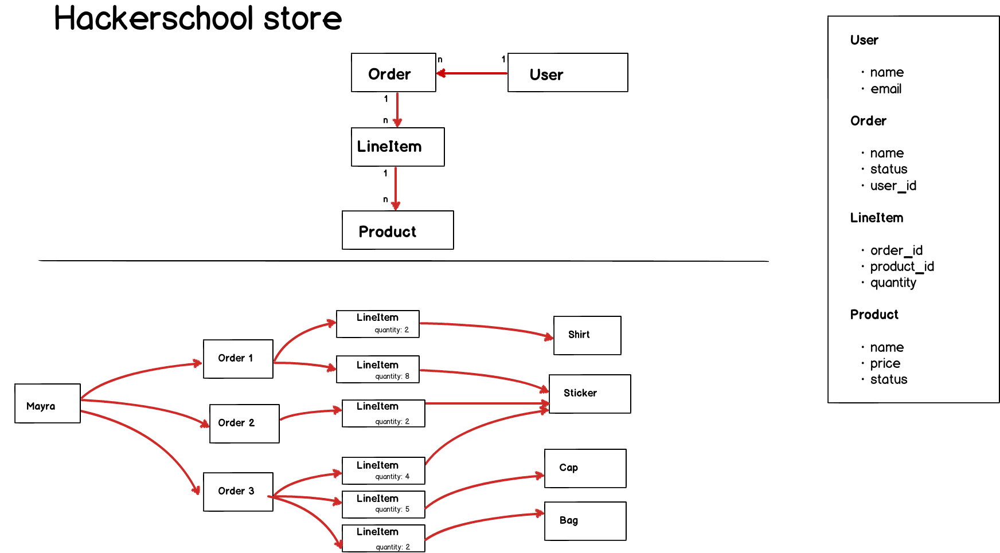

# Hacker Library

Complete the following requirements:

- Courses resource must be inside of generations. So if a user goes to `/generations/1/courses` that view should display courses related to that generation. 

# Hacker store

## Steps

1. Create a new application call hacker_store. Use whatever database manager you feel comfortable with.
2. Create the resources described [here](#model-attributes)
3. Complete user stories described [here](#user-stories)
4. Ensure your application meets the [requirements](#requirements)
5. Once you have finished upload your application to your github account.

## Model Attributes

## User stories

- As a non-registered user 
	- I can see the list of products.
- As a user 
	- I have access to all CRUD products operations
	- I have access to all CRUD users operations
	- I can activate or inactivate products
	- I can create orders
	- I can see the detail of an order (total, number of line items, etc)
	- I can only see orders that I've created

## Requirements:

### General

- Your application must use an authentication gem. You can use [devise](https://github.com/plataformatec/devise)
- Your application must use a css framework gem. You can use [bootstrap](https://github.com/seyhunak/twitter-bootstrap-rails) if you like.

### User

- All user fields are mandatory 
- A user that has orders associated can't be deleted

### Product

- Status can only be active or inactive
- Name must be unique
- Price can't be lower than 0

### LineItem

- Only active products can be associated to the line item
- Quantity must be greather than zero

### Order

- An order can't be deleted
- Only logged users can create orders

## Bonus price

- Use just one form to create orders along with their line items.
- Add a search functionality into products index section. You might want to check [ransack](https://github.com/activerecord-hackery/ransack)
- Create a report section with the top seller products
- Include a functionality to upload picture(s) to a product. You can use [carrierwave](https://github.com/carrierwaveuploader/carrierwave) or whatever gem you prefer